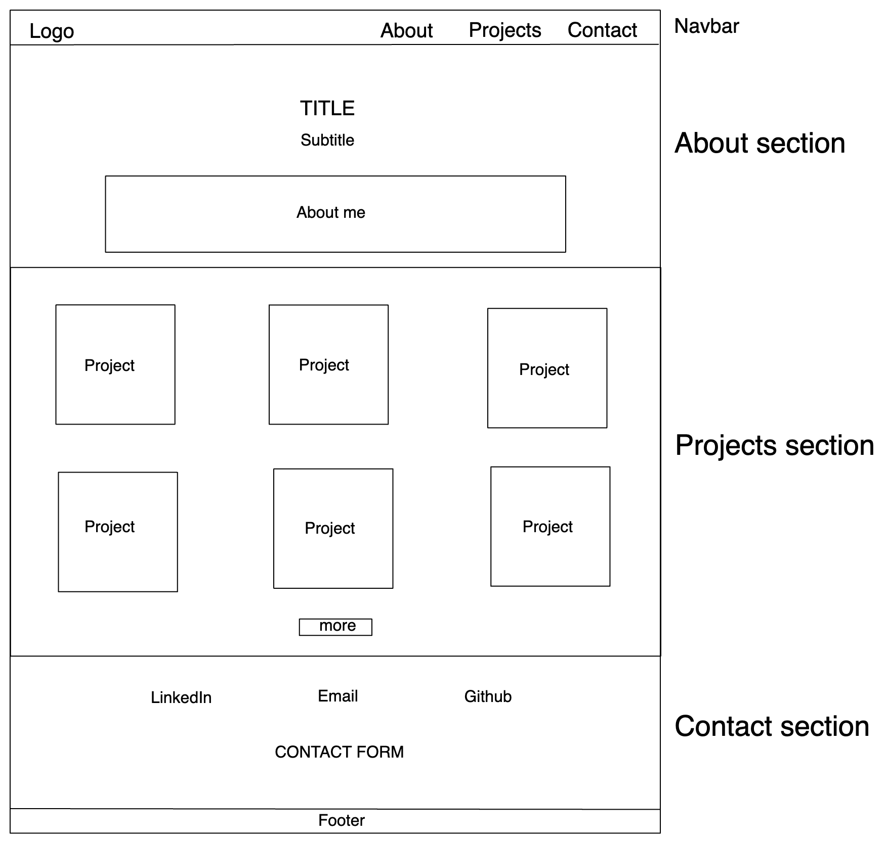

## My Portfolio Website

* Divided into three sections: about, projects, and contact.

* Navigation bar fixed to the top of the page, with links to the different sections.

* The about section occupies the whole screen (100% viewport height) and includes my name and what I do.

* The projects section consists of cards showcasing my coding projects, with links to the source code on GitHub, organised resposively to screen size.

* The contact session includes a contact form and links to my LinkedIn and GiHub profiles.

* Footer at the bottom of the page.

See wireframe below:

